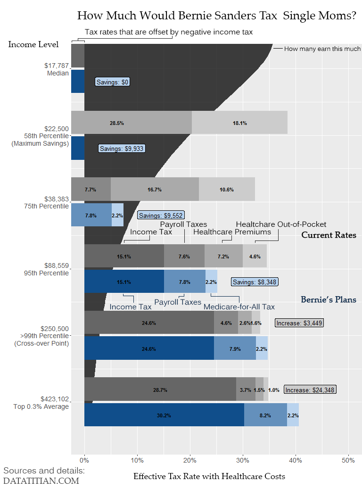

#Just How Much Will Bernie Tax Me?
This project compiles all of the proposed tax plans from Democratic 
Presidential Candidate Senator Bernie Sanders to determine the effective tax
rates for individuals at different outcomes in comparison with current tax laws.

Update Feb 1st: Support added for all filing types and family sizes. Polished plots included for family of 4, single male, and single female. 

Update Feb 4th: Added berniePooled.R and berniePooledPlot.R for calculations that pool the employee and employer burden together. Also added federal unemploymen tax and corrected some errors in the calculations of the employer-paid taxes. This analysis is flawed in that it suggests any savings that the employer experiences would be visible to the employee in the form of a raise. The result is that it makes the Bernie plan look better for the employee than it realy is for incomes from $34K to $228K. Even though it is flawed, it is presented as an example for many who claim that the two should be pooled.

Update Feb 11th: New plot making function barStylePlot that takes arguments for filing status, number of kids, and desired treatment of employer contributions. Automatically selects relevant income levels to display and also plots population prevalence of each income level. Output looks best with adjustment by adding coord_flip() with desired x and y ranges. An example (with some manual annotations) is below. 

The following items are included in the 
calculations:

* Federal Income Tax
* Social Security Tax
* Medicare Tax
* Medicare-for-all Tax 
* Paid Family Leave Tax
* Average healthcare premium costs
* Average healthcare out of pocket costs
* Employer FICA & FUTA Contributions (optional)
* Employer Medicare-for-all Contribution (optional)

The impact of the following [proposals from Bernie Sanders](https://berniesanders.com/issues/how-bernie-pays-for-his-proposals/) is included:

* Rebuild America Act
* College for All
* Expand and Extend Social Security
* Youth Jobs Program
* Paid Family and Medical Leave
* Protect Pensions
* Renewable Energy and Clean Jobs Transition
* Medicare for All

Note that impacts on investment earnings are not included in this project.

